## Hi, I'm Tatyana 👋

Junior Software Engineer (.NET) with an engineering background.  
Focused on backend development, databases, and API-driven systems.  
Interested in international projects and continuous professional growth.

---

### 🔧 Backend & Programming

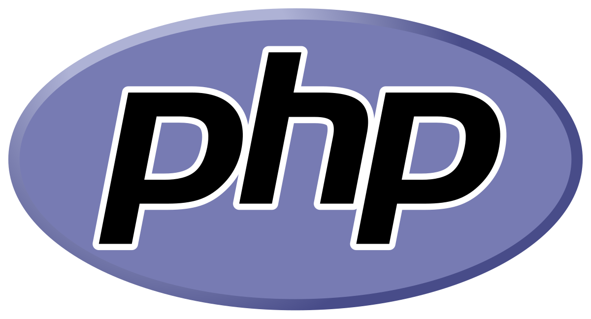
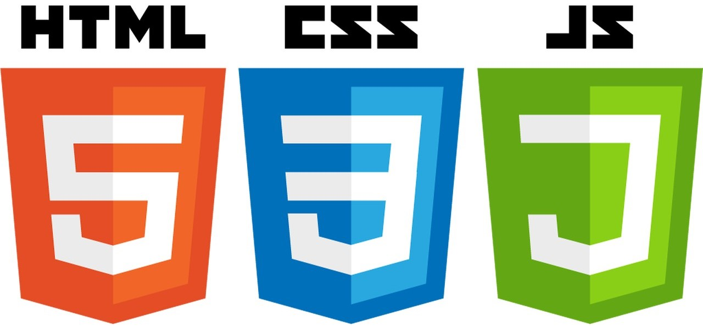

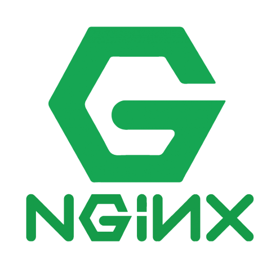
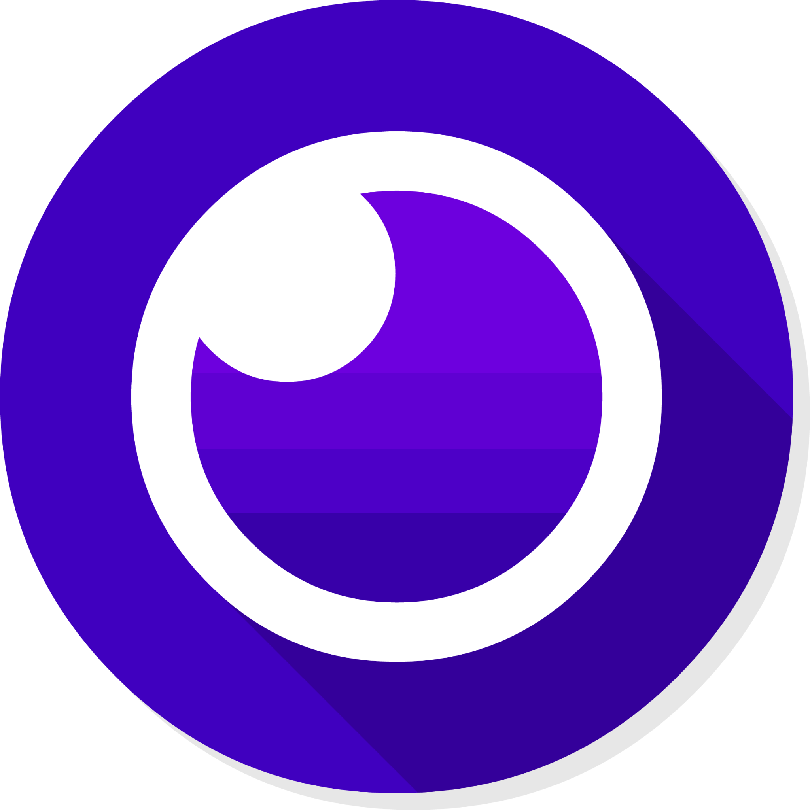
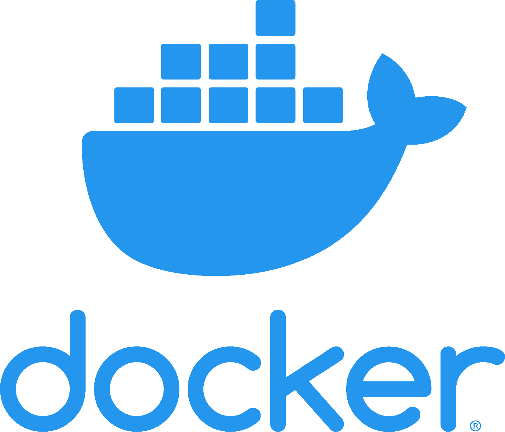

---

### 🗄 Databases
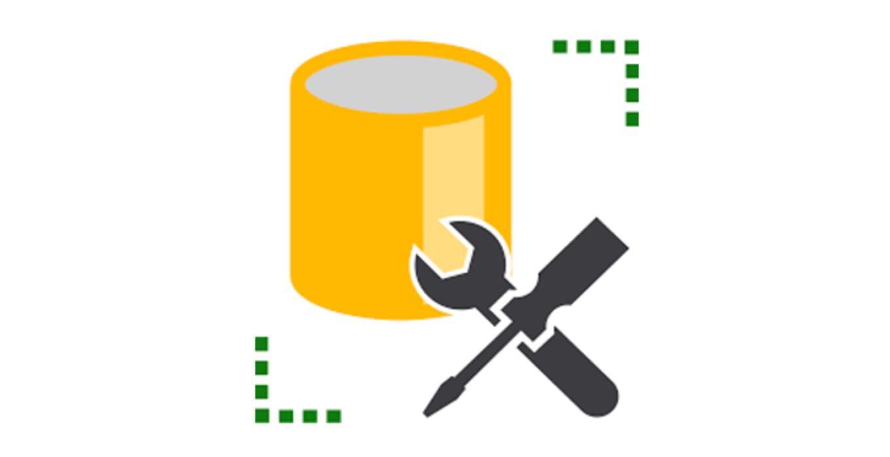

---

### 🧩 Frontend (basic)
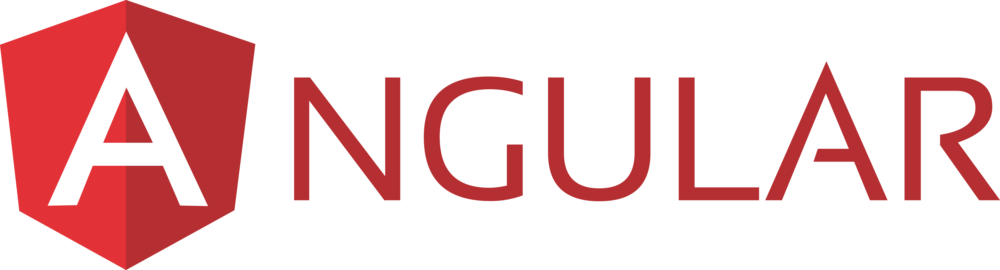

---

### 🛠 Tools & Environment
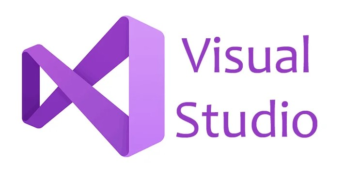
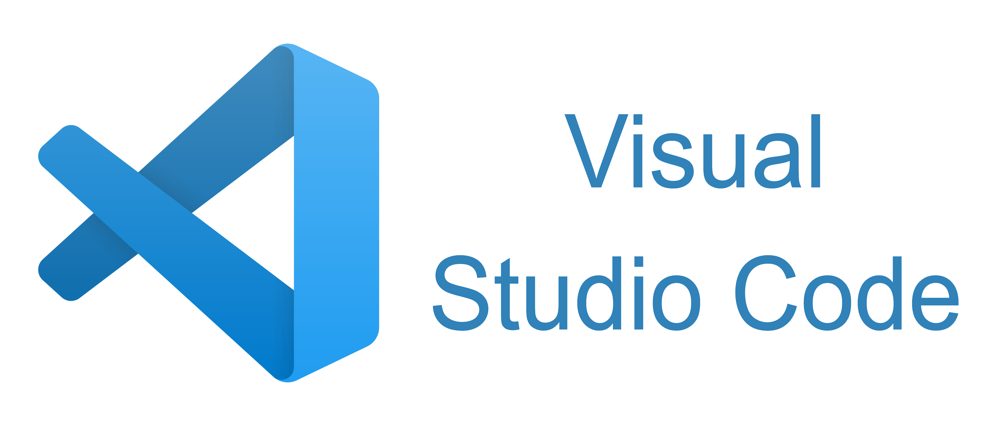
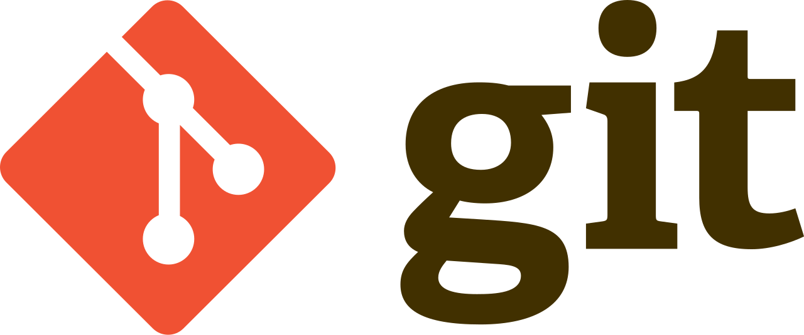
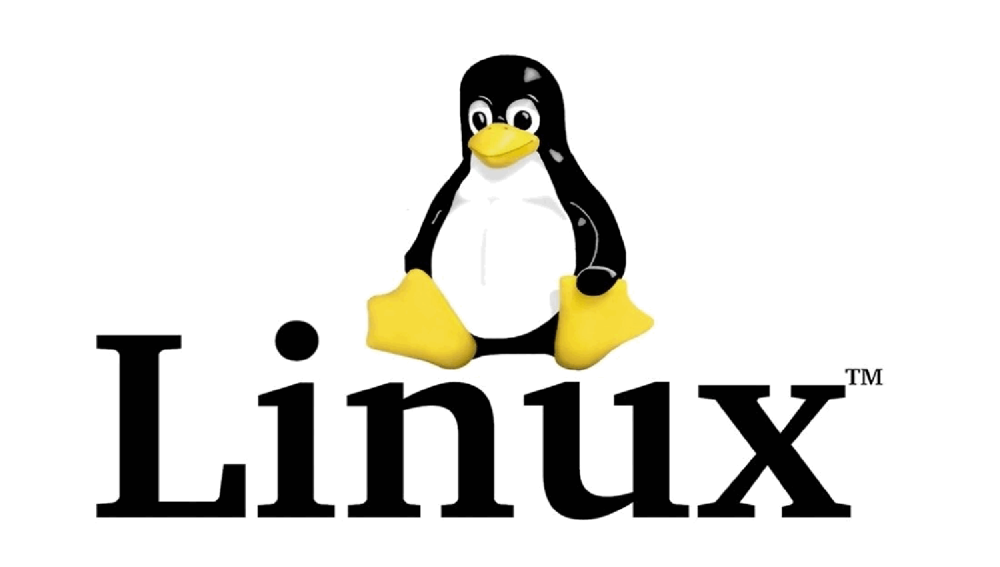
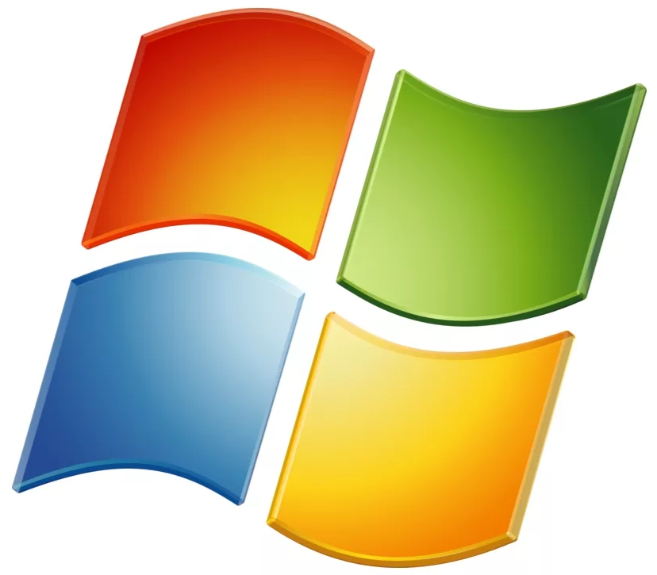

---

### 🧠 Engineering Background
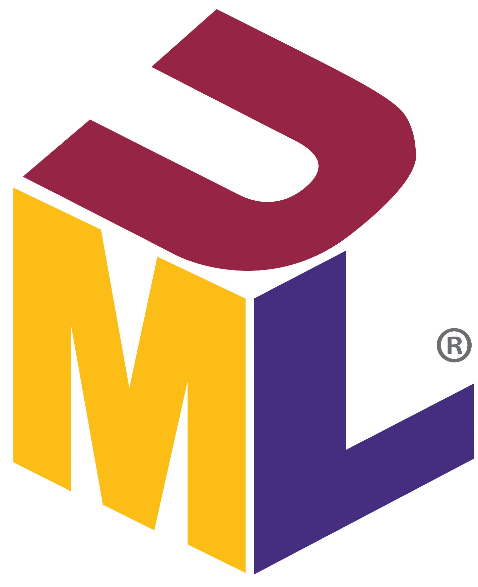
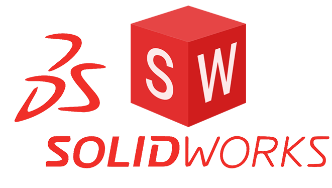
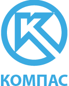

---

### 📌 Projects
- **Restaurant Management Web Application**  
  ASP.NET Core, Entity Framework Core, MS SQL Server, REST API, Identity  

- **Desktop Administrative Application**  
  C#, .NET, SQL  

👉 See pinned repositories below for details.

---

### 🌍 Languages
- Russian — Native  
- English — Elementary  
- Korean — Elementary

---

### 🚀 Career Goal
Grow as a backend .NET developer in an international company and contribute to large-scale global projects, including cooperation with Korean teams.
